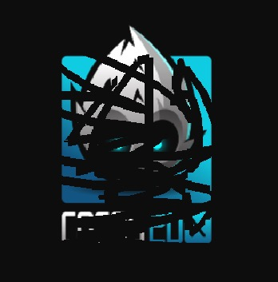

效果图跟用clippingNode实现的那次差不多



直接上代码

```
bool HelloWorld::init() {
   if ( !Layer::init()) {
        return false;
    }
    
    auto winsize = Director::getInstance()->getWinSize();
    auto width = winsize.width;
    auto height = winsize.height;
 
    auto s = Sprite::create("HelloWorld.png");
    s->setPosition(width * 0.5, height * 0.5);
    this->addChild(s);
    
    mDrawNode = DrawNode::create();
    this->addChild(mDrawNode);

    auto listener = EventListenerTouchOneByOne::create();
    listener->onTouchBegan = std::bind(&HelloWorld::onTouchBegan, this, std::placeholders::_1, std::placeholders::_2);
    listener->onTouchMoved = std::bind(&HelloWorld::onTouchMoved, this, std::placeholders::_1, std::placeholders::_2);
    
    EventDispatcher* ed = Director::getInstance()->getEventDispatcher();
    ed->addEventListenerWithSceneGraphPriority(listener, this);
    
    return true;
}

bool HelloWorld::onTouchBegan(cocos2d::Touch *touch, cocos2d::Event *event) {
    mTouchBeganPos = touch->getLocation();
    return true;
}

void HelloWorld::onTouchMoved(cocos2d::Touch * touch, cocos2d::Event * event) {
    Vec2 pos = touch->getLocation();
    std::vector<cocos2d::Vec2> vec(2);
    vec[0] = mTouchBeganPos;
    vec[1] = pos;
    mPoints.push_back(vec);
    mTouchBeganPos = pos;
    refresh();
}

void HelloWorld::refresh() {
    mDrawNode->setBlendFunc(BlendFunc::DISABLE);
    mDrawNode->clear();
    mDrawNode->setLineWidth(10);
    for(std::vector<std::vector<cocos2d::Vec2>>::iterator iter = mPoints.begin(); iter != mPoints.end(); iter++) {
        std::vector<cocos2d::Vec2> vec = *iter;
        mDrawNode->drawLine(vec[0], vec[1], Color4F(0,0,0,0));
    }
}Render->end();
}
```
这次代码比上次的要简单一些，我们先加上背景图，然后再加上一个DrawNode来实现擦除，这个DrawNode设置BlendFunc为BlendFunc::DISABLE，也就是在它与背景混合的地方，只显示自己不显示背景，而他自己又是把运动轨迹绘制成透明的线段，所以就产生了背景图被擦除的效果。如果我们需要限制在局部范围内，只要处理好触摸区域或者添加到容器内即可

然后解释下blendFunc，它是用来处理颜色混合的，我们要将一个图片渲染到屏幕上时，需要将它的颜色（RGBA）与屏幕上已有的颜色混合，我们将要被渲染上去的称为源（src），屏幕上已有的称为目标(dst)，最终颜色显示是它们和各自的因子相乘。如下所示

```
源颜色 Rs Gs Bs As
目标颜色 Rd Gd Bd Ad
源因子 Sr Sg Sb Sa
目标因子 Dr Dg Db Da
最终颜色 Rs * Sr + Rd * Dr Gs * Sg + Gd * Dg Bs * Sb + Bd * Db As * Sa + Ad * Da
```

cocos内置了一些值

```
GL_ZERO					//全部不用 (0,0,0,0)                           
GL_ONE                 //全部使用 (1,1,1,1)
GL_SRC_COLOR           //使用源颜色(Rs, Gs, Bs, As)           
GL_ONE_MINUS_SRC_COLOR //使用反源色(1-Rs, 1-Gs, 1-Bs, 1-As)
GL_SRC_ALPHA           //使用源透明度 (As, As, As, As)
GL_ONE_MINUS_SRC_ALPHA //使用反源透明度 (1-As, 1-As, 1-As, 1-As)
GL_DST_ALPHA           //使用目标透明度(Ad, Ad, Ad, Ad) 
GL_ONE_MINUS_DST_ALPHA //使用反目标透明度(1-Ad, 1-Ad, 1-Ad, 1-Ad) 

const BlendFunc BlendFunc::DISABLE = {GL_ONE, GL_ZERO};
const BlendFunc BlendFunc::ALPHA_PREMULTIPLIED = {GL_ONE, GL_ONE_MINUS_SRC_ALPHA};
const BlendFunc BlendFunc::ALPHA_NON_PREMULTIPLIED = {GL_SRC_ALPHA, GL_ONE_MINUS_SRC_ALPHA};
const BlendFunc BlendFunc::ADDITIVE = {GL_SRC_ALPHA, GL_ONE};
```
这样就不难理解本例中我们使用的BlendFunc::DISABLE了，它意味着混合的时候，不取目标颜色，只显示源颜色。想一下sprite默认应该使用哪种呢？这取决于图片是否已经预乘了alpha，如果是则使用ALPHA_PREMULTIPLIED，否则使用ALPHA_NON_PREMULTIPLIED，很好理解。