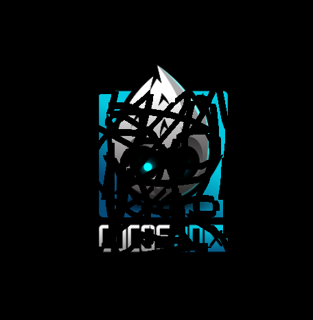

先直接上模拟器上运行效果图


代码也不复杂，只要知道怎么用clippingNode即可，先放上代码

```
bool HelloWorld::init() {
   if ( !Layer::init()) {
        return false;
    }
    
    auto winsize = Director::getInstance()->getWinSize();
    auto width = winsize.width;
    auto height = winsize.height;

    auto stencil = mDrawNode = DrawNode::create();
    
    auto cnode = ClippingNode::create(stencil);
    cnode->setContentSize(winsize);
    cnode->setInverted(true);
    auto s = Sprite::create("HelloWorld.png");
    s->setPosition(width * 0.5,height * 0.5);
    cnode->addChild(s);
    
    this->addChild(cnode);
    
    auto listener = EventListenerTouchOneByOne::create();
    listener->onTouchBegan = std::bind(&HelloWorld::onTouchBegan, this, std::placeholders::_1, std::placeholders::_2);
    listener->onTouchMoved = std::bind(&HelloWorld::onTouchMoved, this, std::placeholders::_1, std::placeholders::_2);
    
    EventDispatcher* ed = Director::getInstance()->getEventDispatcher();
    ed->addEventListenerWithSceneGraphPriority(listener, this);
    
    return true;
}

bool HelloWorld::onTouchBegan(cocos2d::Touch *touch, cocos2d::Event *event) {
    mTouchBeganPos = touch->getLocation();
    return true;
}

void HelloWorld::onTouchMoved(cocos2d::Touch * touch, cocos2d::Event * event) {
    Vec2 pos = touch->getLocation();
    std::vector<cocos2d::Vec2> vec(2);
    vec[0] = mTouchBeganPos;
    vec[1] = pos;
    mPoints.push_back(vec);
    mTouchBeganPos = pos;
    refresh();
}

void HelloWorld::refresh() {
    mDrawNode->clear();
    mDrawNode->setLineWidth(10);
    for(std::vector<std::vector<cocos2d::Vec2>>::iterator iter = mPoints.begin(); iter != mPoints.end(); iter++) {
        std::vector<cocos2d::Vec2> vec = *iter;
        mDrawNode->drawLine(vec[0], vec[1], Color4F::RED);
    }
}

```

简单介绍一下clippingNode。它有一个stencil(可以是任何Node)用来决定切割区域，clippingNode的children都会被stencil切割，代码里我们的stencil是一个drawNode，需要擦除的图片HelloWorld.png添加为clippingNode的子节点。本来除了drawNode渲染的区域外都会被切割，我们通过setInverted接口设置后变成了相反，drawNode渲染的区域将被切割，被切割后我们就看到了图片下面的黑色背景，于是就呈现出擦除的效果。

使用setAlphaThreshold接口可以设置alpha阈值，当stencil中像素的alpha值大于这个阈值时，才会被绘制