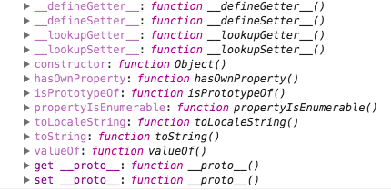
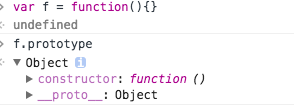

### \_\_proto\_\_

js的原型链继承很简单，对一个object，如果去获取它本身不存在的属性或方法，则往它的\_\_proto\_\_上查找，因为\_\_proto\_\_本身也是一个object，所以如果没找到，则往\_\_proto\_\_的\_\_proto\_\_上查找，跟沿着一条链条走一样，直到找到返回，或者\_\_proto\_\_为null或undefined找到了尽头。

原型链不可能无止尽的延伸，所以js中有一个默认的object，它的\_\_proto\_\_就是undefined，除非我们强制打断原型链，否则最终都会查找到这个object上，它是长这个样子的,可以看到它是没有\_\_proto\_\_属性的



我们可以对一个object的\_\_proto\_\_属性随意赋值，但如果赋成null或者undefined，则它的\_\_proto\_\_属性变成了undefined，如果赋成基础数据类型，并不会改变其\_\_proto\_\_属性

### \_\_proto\_\_来源

如果我们没对object的\_\_proto\_\_赋值，则它的\_\_proto\_\_来源于使用Object.create方法调用时传给他的参数，虽然构造一个object有好几种写法，例如

```
var a = {}
var b = new f();
var c = Object.create(proto)
```
但它们实际上都是执行了Object.create，例如var a = {}和var a = Object.create(Object.prototype)是一模一样的，而var b = new f()则基本可以认为等同于var b = Object.create(f.prototype)。

### function的prototype

我们经常通过function来构造一个object,这种情况使用了该function的prototype来作为Object.create的参数，如果我们没有给function指定一个prototype，则它默认的prototype是这样的



可以看到，function默认的prototype有一个属性constructor指向函数自己，它的\_\_proto\_\_就是我们前面提到的原型链尽头的那个object（真该给他取个什么名字才好），当然我们可以给function指定一个prototype，而不使用它默认的，那就是我们在js中实现继承的办法。

这里顺便牵扯到一个问题，我们都知道object的constructor属性指向它的构造函数，所以在设定prototype时，必须再将prototype.constructor指向构造函数

```
var f = function(){}
f.prototype = {"1":1}
//f.prototype.constructor = f
var t = new f();
```
如果没有注释掉的那句，则t.constructor就不是f，而是变成了function Object(){[native code]}了

### 缩短原型链
如果原型链过长，可能会带来性能问题。所以需要注意的是尽量不要去扩展内置类型的原型。直接获取属性和for in函数都会查询原型链，如果想避免查询原型链，可以使用hasOwnProperty方法来判断

使用var a = Object.create(null) 代替 var a = {}的区别，前者明确将\_\_proto\_\_设置为null，查找属性时就不会再往原型链上查找了，后者\_\_proto\_\_其实是Object.prototype

