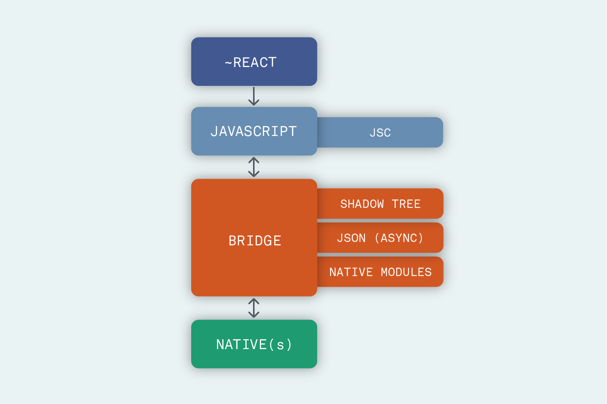

### 前言

在网上看到一个介绍ReactNative新架构的一个[博客](https://formidable.com/blog/2019/react-codegen-part-1/)，看起来很不错，所以就直接翻译过来，还省去了自己去整理的功夫。因为不打算拿去投稿，所以翻译就随意一点，不追求和原文完全一致，大概意思到了就行了，如果发现有错误的地方，还请随时指正~

ReactNative官方最初是在2018年宣布要对架构进行重大调整，目的是为了解决自身长久以来存在的诸多问题。在这个系列中，我们会历数这次重构中的主要内容。我们避免使用代码演示，尽可能让解释通俗易懂，并分享我们对这些新技术方案的激动心情。

### React and Codegen

作为这个系列的第一篇，我们将讨论这次重构中切实影响写代码的一个方面：新的React特性以及一个叫做Codegen的工具。

在深入之前，我们来回顾一下基础知识：ReactNative是一个开源的跨平台移动应用开发解决方案，它让我们可以用React以及JavaScript来开发一个完全原生的移动应用。不光是创造和发展它的Facebook公司在使用ReactNative，其它公司例如亚马逊和微软，以及很多初创公司都在使用它。

为了帮助更好地理解ReactNative的工作原理，我们准备了下面这张图

如图所示，ReactNative结构上有四个核心部分：React代码部分，由代码翻译而来的JavaScript部分，一系列统称为"桥"的部分，以及原生部分。

ReactNative当前架构的一个关键点是：它的两个端——JavaSvript端和Native端，彼此并不了解对方的情况，这意味着，它们的通信必须依赖“桥”传递JSON信息。消息被发到原生端后，寄希望于能收到返回数据，但这无法得到保证。

为了克服ReactNative当前存在的各种限制，Facebook的开发团队决定重新思考这个异步信息传递的方案，并着手开发一套新的架构。在新的架构中，前文所述的四个核心部分都分别进行了改进。这篇我们就将讲述第一个核心部分：React。

React核心库开发人员的工作成果，对ReactNative团队的帮助非常大。这意味着ReactNative将具备React在ReactConf2018([概述](https://reactjs.org/blog/2018/11/13/react-conf-recap.html))上宣布的所有新特性，尤其是Andrew Clark展示的并发模式和同步事件回调的概念，这些特性从React16.6起开始支持，支撑了一些很重要的底层功能实现，我们将在第三篇中再做介绍。

在这次重构中，会影响到ReactNative代码开发的React的新特性有：使用Suspense来实现组件延迟渲染，以及通过ReactHooks来使用函数组件代替类组件。

ReactNative团队在代码静态检查（Flow或者TypeScript）上也很重视，尤其是：他们正在开发一款叫做CodeGen的工具来自动生成JS和原生端的接口代码，借助于类型化JavaScript的可信任性，这个生成工具可以用来生成Fabric和TurboModules(新架构中的功能点，将在第三节中介绍)所需要的接口文件，从而实现更可靠的端之间数据传递。这种自动化也可以提高端之间数据传递的效率，因为可以避免每次都验证数据的合法性。

总之，在上面ReactNative的架构图上，使用新的架构来描述第一个部分，应该是这个样子：

这就是ReactNative新架构简介的第一部分，其它内容将在接下来的二三四篇中继续介绍。这次ReactNative的架构升级，可以让开发者在少修改甚至不修改代码的基础上，在很多方面都带来极大提高，非常值得期待。