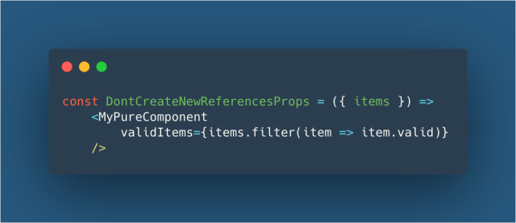
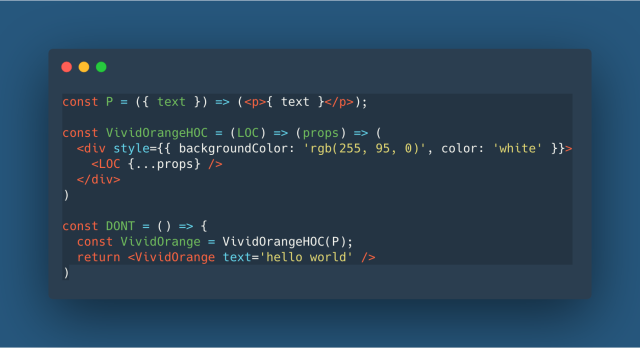

这篇文章是翻译的medium上的[React Native Performance: Do and Don't](https://medium.com/hackernoon/react-native-performance-do-and-dont-1198e97b730a)，本来是想拿来做内部技术周刊的投稿，但没有被选中，既然花费了时间和精力去翻译，就不想浪费掉，所以放到博客中来。原文的发表时间是2019年5月31日，所以还算比较新，也有4300个赞，所以质量还算可以，但这篇文章和很多技术博客（尤其是我的……哈哈）一样有个问题，讲了一些偏细节的点，但没有提炼出本质。当然，如果说到RN性能的本质，我觉得只有一个：**避免重复渲染**。这是后话，以后再叙吧，以下就是翻译全文，这算是第一次写翻译稿，还请轻拍。

这篇文章是作者基于两年时间开发Nelio的经验写作而成，Nelio是一个使用React Native开发的跨平台移动应用。阅读本文需要具备一些React或者React Native的开发经验。当然，本文所讲的内容并不完全局限于React Native，很多建议也适用于普通的React应用。此外，本文也不能将所有关于性能的方面进行非常全面的阐述，所以如果你遵循了本文的所有建议，但仍然存在性能问题，也请不要苛责：）

Nelio是一家总部位于巴黎的初创公司，致力于高端优质食品的派送。这家公司也比较「追求质量」，体现在很多个方面，其中就包括了代码编写。性能对移动应用来说，是非常重要的方面，它直接影响到用户对其提供服务的感受。坦白而言，能够满足自己和客户的期待，在很多时候都非常的不容易，所以这篇文章总结了他们在开发阶段所有的那些经历：学习到的知识、犯过的错误、碰到的问题及其解决方案。希望本文对大家能够有所启发。

### React和React Native的性能

对于React开发者来说，React Native非常容易入门，因为React Native和React具备相同的架构。但在实际开发中，React Native需要深入理解的内容也很多，就像一个专业的React Web开发者需要去深入了解浏览器的知识一样。

首先需要说明的是：
> 所有React性能相关的知识，都适用于ReactNative

如果要了解React Native性能相关的内容，第一步可以去看看[React的官方文档](https://reactjs.org/docs/optimizing-performance.html)，然后再看下官方的[React Native性能相关文档](https://facebook.github.io/react-native/docs/performance)，这些资料非常有用，不过本文在这里不再复述，而着重于在实际开发中为了提升性能采用了什么解决方案，避免了什么问题。本文也不会花费太多时间去讨论React Native引擎自身性能是否足够好，是否需要考虑转向使用Flutter或者原生开发，市面上有很多表现优异的React Native应用，而我们的目标就是努力成为其中之一。

### 切记提供UI反馈
性能更多体现在用户的感知层面，而不是精确测量一个函数的运行时间，而且相对于关心「卡了多长时间」，你应该更关心「为什么卡」和「什么时候卡」。一个广泛的共识是：你应该在用户操作后的100毫秒内给予反馈，请在脑海中牢记这一红线，记住：尽可能早地给予用户反馈。

给予用户反馈的方法有很多种，在React Native中，有一个实用而且简单的方案就是多使用[TouchOpacity组件](https://facebook.github.io/react-native/docs/touchableopacity)，它能够在用户交互时让用户感受到变化，从而明白自己的操作得到了响应。

在打开一个新页面时，你需要考虑数据加载的问题。一个比较好的方案，是先尽快打开页面，展示那些已有的能够渲染的数据，然后在正在加载内容的地方使用一个loading组件或者placeholder组件，这种做法也被叫做[skeleton screens](https://uxdesign.cc/what-you-should-know-about-skeleton-screens-a820c45a571a?gi=333c21cddca9)。

如果点击会产生一些其它效果，例如增加数据、点赞、发送聊天信息等，这些行为都伴随着与服务器通信。在这种场景下，你不应该等收到服务器消息后再刷新页面，而应该提前让客户端表现得像已经成功收到了服务器消息，这种叫做[optimistic ui](https://uxplanet.org/optimistic-1000-34d9eefe4c05?gi=215ed6a60438)的技术方案目前已经被广泛使用。

在Nelio开发中，我们使用GraphQL和ReactApollo，ReactApollo通过[optimisticResponse](https://www.apollographql.com/docs/react/features/optimistic-ui)可以很方便地实现这种技术方案，当然通过别的方式也可以实现，例如Redux。

### 图片
对一个React Native应用来说，图片加载是体现性能和可用性的一个重要方面。这对于Web开发者来说，可能会感到有些奇怪，但仔细想想，这其实是浏览器帮忙做了大量的工作，例如下载、缓存、解码、缩放以及展示这一整套工作流，但在React Native开发中，这些就需要自己去想办法了。

#### 使用缓存策略
React Native官方提供了[Image组件](https://facebook.github.io/react-native/docs/image)，用来展示单张图片时基本毫无压力，但如果需要同时展示大量图片就略显吃力了，例如会出现闪烁或者停止加载的现象，为此我们选择了使用react-native-fast-image组件。值得一提的是，该组件有非常庞大的使用群体，从npm上的周下载数据来看，占据了react-native下载量的12%，和Expo的下载量几乎一样大。

#### 只加载需要尺寸的图片
React-native-fast-image组件能解决很多问题，但我们发现应用在运行中仍然会随机出现一些图片相关的Crash。在进行调研后，我们发现此时应用在同时下载、缓存和缩放数十张尺寸为几百K的图片，我们尝试直接从源头上解决该问题，就是限制用户上传图片的尺寸，但这个解决方案并不是最优的。在任何时候，**都要时刻注意展示图片的数量和尺寸**，判断会否会对设备造成很大的压力。比较好的方案是，将大部分工作提前做好，而不是留到用户设备上去做。即使在展示图片时还不存在内存问题，也最好能将图片剪辑成真正需要展示的尺寸，这样可以减轻用户的设备压力。

我们选择使用了一个图片缩放CDN的解决方案，它能支持用户下载准确符合展示尺寸的图片。准确来说，我们选择使用的是[CloudImage](https://www.cloudimage.io/)，它能支持在请求图片数据时指定尺寸信息。实际接入时，我们修改了GraphQL接口，将图片URL转换成CloudImage所需的格式，当然也可以在客户端代码中修改。除了CloudImage之外，也有其它的选择方案，例如[Cloudinary](https://cloudinary.com/)，或者采用一些开源的方案例如[imgProxy](https://github.com/imgproxy/imgproxy)或者[Thumbor](https://github.com/thumbor/thumbor)等等。
#### 合理使用PureComponent

正如之前所说，React Native应用本质上也是React应用，所以适用于React应用的大多数优化建议，也同样适用React Native应用。而在所有React性能优化建议中，也许提到最多的就是：是否要使用PureComponent（或者[React.memo()](https://reactjs.org/docs/react-api.html#reactmemo)）。简单来说，通常在React应用中，重复渲染并不是很大的问题，但在一个复杂的移动应用中，就会变得严重了。

PureComponent能够减少重复渲染，它只有在props发生了变化时才刷新，更准确地说，是在shouldComponentUpdate方法中对props进行浅比较来进行判断。有的人认为不管什么情况都使用PureComponent就好了，但作者认为这种做法弊大于利，这实际上是一种典型的[过早优化](http://wiki.c2.com/?PrematureOptimization)的做法。

在使用PureComponent时，如果想要减少重复渲染，那么你需要做的是：**在其父组件render方法里，不要创建新的props变量**。

在创建新的props变量的写法中，主要是使用新的object和新的function作为props，另外还有使用新组件作为children props的示例，但从本质上讲，JSX实现的组件对象最终还是一个JS Object，如下图所示：

另外还需要注意：array也是Object，如果我们写一些函数式的代码，需要注意，很多时候是得到一个新的数组对象，例如下面例子中，item.filter每次都会生成一个新的数组对象：

另外，在开发中经常会用到一个技术方案叫[renderProps](https://reactjs.org/docs/render-props.html)，它将一个能够返回组件的render函数作为props，既然是函数，就需要小心：不要在render时创建一个新的。

在Nelio中，我们还没开始使用React Hooks，它是从React Native 0.59版本起才开始支持，如果你还没使用，可以考虑去尝试一下，我们使用了[recompose](https://github.com/acdlite/recompose)。recompose对React hooks有很大的启发，其中Pure、withHandlers和withPropsOnChange等功能接口，对项目开发中代码质量的保障和性能提高，都起到了非常大的作用。

### 不要滥用高阶组件

随着应用复杂度的提升，逐渐会有在组件间共享逻辑的需求，这时通常会选择使用[高阶组件](https://reactjs.org/docs/higher-order-components.html)。高阶组件本身是个不错的技术方案，虽然它也确实增加了组件层级和代码复杂度，而真正需要注意的是：**不要滥用高阶组件，尤其是在render函数里**。因为每次调用高阶组件函数，都会生成一个新的组件，在render函数内使用，会导致重复渲染的问题，而且整个高阶组件结点树的所有生命周期函数可能也会重新执行，如下图所示：

记得在开发中一次错误的使用场景，我们在混合使用了RenderProps和高阶组件时出了问题，作为ReactApollo的使用者，我们频繁使用了[Apollo Query Component](https://www.apollographql.com/docs/react/essentials/queries/#basic)来从后端获取数据，同时我们的代码风格是尽可能使用recompose，所以最初的实现方案是使用高阶组件fromRenderProps来包装一个Apollo Query组件，如下图DontMixHOCAndRenderProps中所示，但这个方案只适用于不需要动态参数的场景，一旦需要动态参数就行不通了。因为[fromRenderProps不支持传入额外的参数](https://github.com/acdlite/recompose/issues/702)，为了解决这个问题，我们找了两个解决方案，第一个是不使用Recompose HOC，而是使用普通的组件；第二个方案是使用[Appolo graphQL HOC](https://www.apollographql.com/docs/react/api/react-apollo/#graphql)，因为它能够满足我们的需求，所以就采用了这个方案。

另外一个高阶组件的使用场景，是基于特定props来构造高阶组件实例，例如这个[demo](https://repl.it/repls/VividOrangePipeline)，我们在项目中有类似的实现方案，在经过考虑后全部删除了，改成使用renderProps或者直接使用组件作为props的方式。

### 避免庞大的reducer函数

如果你没有使用GraphQL，那么很可能你使用了[Redux](https://redux.js.org/)，而我们两者都使用了，虽然我通常并不推荐这么做。如果你没有使用[normalizr](https://github.com/paularmstrong/normalizr)或者[rematch](https://rematch.gitbooks.io/rematch/#getting-started)来配合Redux，或者需要手动实现reducer函数，请一定谨记**只修改发生了变化的state**，如果你认真了解过[Redux基础教程](https://redux.js.org/basics/reducers#designing-the-state-shape)， 那你应该已经注意到了这点，但如果没有，就再去仔细阅读一下吧：）

如果你像我们一样偶尔匆匆赶代码，那么有可能当你从后端获取一组数据然后存储到state里时，你会很快写出以下代码：

如果这么写，而且在刷新列表时出现了性能问题，那你需要改进的就是：只更新state里真正发生了改变的部分。更准确地说，是更新它们的引用，如果一个数据的实际内容和之前相比没有发生变化，那你就不要在Redux内让它指向一个新的引用，否则将会导致使用它的组件发生多余的重复刷新：组件展示的内容没有任何变化，但销毁了老组件并创建了新组件。

### 不要轻易复用函数

如果使用了Redux，那么调用connect函数时，你一定会用到mapStateToProps函数。随着工程复杂度的提高，mapStateToProps也越来越庞大复杂，可能mapStateToProps内充满了复杂的计算，而且出现了很多重复渲染，这有点出乎意料，[因为mapStateToProps返回的对象是进行了浅比较来判断是否发生了变化的](https://redux.js.org/faq/react-redux#why-is-my-component-re-rendering-too-often)。这个问题本质上和前面PureComponent提到的问题是一样的，在父组件每次渲染时给PureComponent组件提供了一个新的props，就会导致重新渲染，所以这里需要做的就是：**在mapStateToProps里对state没有发生变化的部分，就让其生成的props也不要发生改变**。

明白问题所在之后，只要使用[reselect](https://github.com/reduxjs/reselect)库就可以解决这个问题了，虽然它会增加一些代码复杂度，但却是非常值得的。不过也要小心，**错误地使用reselect可能也会导致性能问题**。尤其是在项目的不同地方或者不同组件之间共享reducer函数时，reselect提供了缓存功能，但对一个函数，cache也只有一个，Reselect官方考虑到了这个问题并提供了[解决方案](https://github.com/reduxjs/reselect#sharing-selectors-with-props-across-multiple-component-instances)，简单来说就是给每个需要的组件创建各自的selector对象，其它库例如[re-reselect](https://github.com/toomuchdesign/re-reselect)使用其它方案也解决了这个问题。

总之：在不同组件或者组件实例间复用函数时，都要谨慎对待。

### 更多

在移动应用开发过程中，想要一次性解决性能问题是不太现实的，通常都需要持续的投入，下面介绍一些我们正在尝试的一些改进方案。

#### 升级React Native到0.59版本

如前面所说，React Native 0.59版本引入了React Hooks的功能，使用hooks可以避免使用recompose库，因为recompose库目前已经不再维护了。此外React Native 0.59版本还升级了Android端的JavaScriptCore引擎，新的JavaScriptCore引擎能带来大概25%左右的性能提高，而且支持64位CPU架构，可以满足[Google应用商店从2019年8月1日起开始对所有App的强制要求](https://developer.android.com/distribute/best-practices/develop/64-bit)。

#### FlatList优化

在渲染列表时，应该选择基于[VirtualizedList](https://facebook.github.io/react-native/docs/virtualizedlist)实现的组件，例如[FlatList](https://facebook.github.io/react-native/docs/flatlist)或者[SectionList](https://facebook.github.io/react-native/docs/sectionlist)，根据列表的单元行数量，列表组件的复杂度和尺寸等情况，尽可能地优化其props的使用，因为列表组件会对页面的性能产生直接影响。

#### 使用工具检测性能问题

为了更好理解性能问题，你需要了解组件被装载和渲染的次数，使用[React Profiler](https://reactjs.org/blog/2018/09/10/introducing-the-react-profiler.html)可以帮你发现卡顿问题的来源。还有[spying the queue](https://github.com/facebook/react-native/blob/0ee5f68929610106ee6864baa04ea90be0fc5160/Libraries/BatchedBridge/MessageQueue.js#L88)，它是React Native引擎在JavaScript代码和原生代码之间传递数据的通道，在寻找卡顿原因时会很有帮助，可以点击[这里](https://blog.callstack.io/reactnative-how-to-check-what-passes-through-your-bridge-e435571ffd85)了解更多。假如应用在交互时只响应了一部分，例如scrollView可以正常滚动，按钮点击会变化透明度，但是JavaScript回调却没被调用，这意味着原生代码被执行了，但JavaScript代码没有，那么这种情况下，我们需要去查看一下数据通道是否因为太过繁忙而被堵塞。
